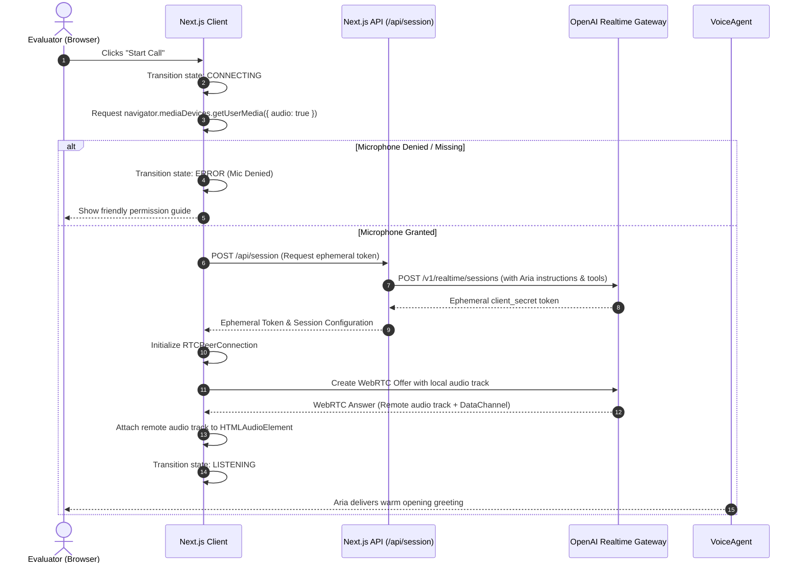
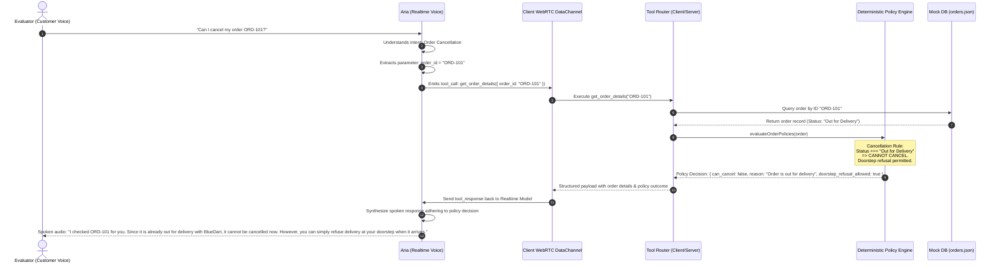
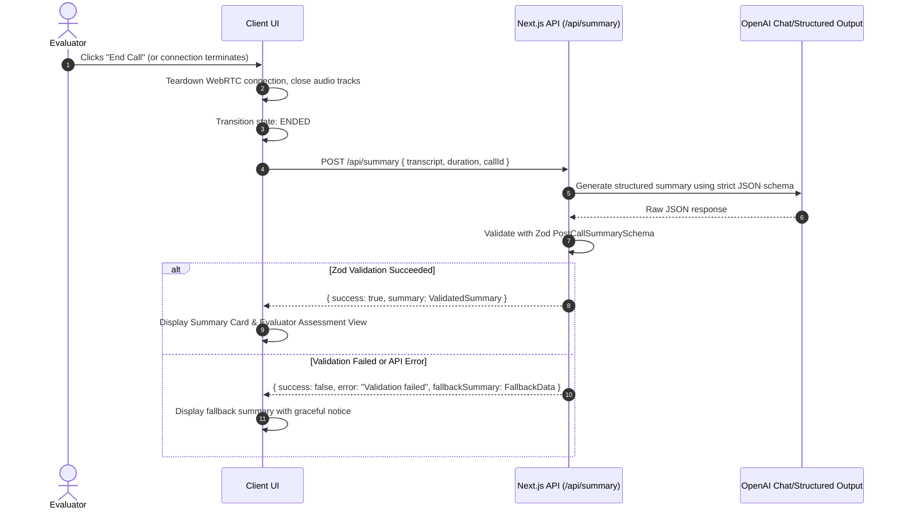

# Aura Skincare Voice AI Support Agent — System Architecture

## 1. Executive Summary & Architectural Philosophy

This document outlines the architectural blueprint for **Aria**, an intelligent, browser-based voice customer support agent for **Aura Skincare**, a premium organic Indian direct-to-consumer (D2C) brand.

The system is engineered around a core architectural principle:
> **Intent and language understanding are handled by the AI voice model, but business rules and policy decisions are strictly executed by deterministic software code.**

The LLM is treated as an empathetic, natural conversational interface. It is **never** permitted to independently author, evaluate, or override business policies such as cancellation eligibility, return windows, shipping tariffs, or Cash-on-Delivery (COD) rules. When an evaluator or customer requests an order action or policy determination, the agent must invoke a structured tool, execute deterministic business logic, and speak the deterministic result naturally.

---

## 2. High-Level Architecture Diagram

```mermaid
flowchart TD
    subgraph Client [Browser Client - Next.js]
        Mic[Computer Microphone] -->|Audio Stream| PC[WebRTC PeerConnection]
        Speaker[Speakers / Headphones] <--|Audio Stream| PC
        UI[Aura Skincare UI & State Machine]
        DevDrawer[Dev Observability Drawer]
        TranscriptView[Live & Post-Call Transcript]
        SummaryCard[Structured Summary Card]
    end

    subgraph Backend [Next.js Server / API Routes]
        SessionAPI["/api/session (Mints Ephemeral Token)"]
        SummaryAPI["/api/summary (Structured Post-Call Extraction)"]
    end

    subgraph VoiceEngine [Realtime Voice Engine (OpenAI Realtime WebRTC)]
        VoiceGateway[WebRTC Gateway]
        VoiceModel[Aria Voice Agent / GPT-4o Realtime]
        DataChannel[WebRTC Data Channel]
    end

    subgraph CoreLogic [Deterministic Application Layer]
        ToolRouter[Tool Call Handler]
        OrderService[Order Lookup Service]
        PolicyEngine[Deterministic Policy Engine]
        MockDB[(data/orders.json)]
    end

    %% Session Setup
    UI -->|1. Request Session| SessionAPI
    SessionAPI -->|2. Mint Ephemeral Token| VoiceEngine
    SessionAPI -->|3. Return Token/SDP| UI

    %% WebRTC Connections
    PC <===>|WebRTC Audio Stream| VoiceGateway
    PC <===>|DataChannel Events & Function Calls| DataChannel
    DataChannel <===> VoiceModel

    %% Intent & Tool Execution Flow
    VoiceModel -->|Function Call: get_order_details| ToolRouter
    ToolRouter --> OrderService
    OrderService --> MockDB
    ToolRouter --> PolicyEngine
    PolicyEngine -->|Deterministic Rules & Outcomes| ToolRouter
    ToolRouter -->|Structured JSON Result| DataChannel
    DataChannel --> VoiceModel

    %% State and Transcripts
    DataChannel -->|Realtime Transcripts & Events| UI
    UI --> TranscriptView
    UI --> DevDrawer

    %% Post Call Flow
    UI -->|Call Ended: Send Transcript| SummaryAPI
    SummaryAPI -->|Zod Validated Summary| SummaryCard
```

---

## 3. Separation of Responsibilities

The system is strictly divided into decoupled architectural layers:

```
┌────────────────────────────────────────────────────────┐
│                      UI LAYER                          │
│  Aura Branding • State Visualizer • Call Controls       │
│  Live Transcript • Orders Helper • Post-Call Summary   │
├────────────────────────────────────────────────────────┤
│                     VOICE LAYER                        │
│  Microphone Capture • WebRTC Audio • Speaker Playback  │
│  Connection Lifecycle • Agent State Machine            │
├────────────────────────────────────────────────────────┤
│                     AGENT LAYER                        │
│  Aria Persona • Indian Support Tone • System Prompt     │
│  Intent Recognition • Conversational Turn Management   │
├────────────────────────────────────────────────────────┤
│                     TOOL LAYER                         │
│  Tool Declarations • Argument Parsing • Tool Dispatch  │
│  Result Serialization • Tool Failure Normalization     │
├────────────────────────────────────────────────────────┤
│                    POLICY LAYER                        │
│  Cancellation Rules • Return Rules • Shipping Rules    │
│  COD Eligibility • Pure Deterministic Functions        │
├────────────────────────────────────────────────────────┤
│                     DATA LAYER                         │
│  Mock Database (orders.json) • In-Memory Lookup        │
│  Read-Only Isolation • Normalized Entities             │
├────────────────────────────────────────────────────────┤
│                     CALL LAYER                         │
│  Transcript Assembly • Turn Sequencing • Duration     │
│  Post-Call Summary Extraction • Zod Schema Validation   │
└────────────────────────────────────────────────────────┘
```

### Detailed Layer Specifications

| Layer | Primary Responsibilities | Dependencies | Technologies / Components |
| :--- | :--- | :--- | :--- |
| **Voice Layer** | Microphones, audio playout, WebRTC session negotiation, connection status, latency monitoring. | Browser WebRTC, Web Audio API | `useVoiceClient`, WebRTC `RTCPeerConnection`, `MediaStream` |
| **Agent Layer** | Aria persona instructions, brand tone (Indian English, polite, concise), tool registration. | Realtime Voice Engine | System prompt, Realtime API session instructions |
| **Tool Layer** | `get_order_details` schema, parameter validation, invoking order service, standardizing errors. | Order & Policy Layers | Zod schema, Realtime function call handlers |
| **Policy Layer** | Deterministic business rules (cancellation, returns, shipping fees, COD). Pure functions, zero side effects. | None (domain core) | TypeScript pure modules (`src/lib/policies/`) |
| **Data Layer** | Local mock database query, order ID formatting and normalization, schema validation. | `data/orders.json` | TypeScript reader, Zod entity schemas |
| **Call Layer** | Accumulates chronological turns, records tool events, sends call transcript for post-call summary. | Backend LLM route | Next.js API Route (`/api/summary`), Zod validation |
| **UI Layer** | Minimalist premium aesthetic, live state badge, call controls, quick test orders, debug telemetry. | React, Tailwind CSS | Next.js App Router, Tailwind CSS, Lucide icons |

---

## 4. Component Architecture & UI Hierarchy

```
src/
└── app/
    ├── page.tsx                      # Main Page Container
    └── layout.tsx                    # Aura Skincare Brand Layout & Providers
        │
        ├── components/ui/
        │   ├── Header.tsx            # Brand Logo, Tagline, Evaluator Context
        │   ├── StatusBadge.tsx       # Live State Indicator (IDLE, LISTENING, etc.)
        │   └── AudioWaveform.tsx     # Subtle animated visualizer tied to agent state
        │
        ├── components/voice/
        │   ├── VoiceController.tsx   # Start/End Call buttons, device error alerts
        │   └── AgentCard.tsx         # Aria Avatar/Orb, current status, active intent
        │
        ├── components/transcript/
        │   ├── LiveTranscript.tsx    # Chronological auto-scrolling message bubbles
        │   └── TranscriptItem.tsx    # User turn, Aria turn, and tool event badges
        │
        ├── components/orders/
        │   └── TestOrdersHelper.tsx  # Evaluator quick-reference card (ORD-101..103)
        │
        ├── components/summary/
        │   └── PostCallModal.tsx     # Structured post-call analysis & JSON viewer
        │
        └── components/dev/
            └── ObservabilityDrawer.tsx # Collapsible drawer: WebRTC stats, Tool payloads, Latency
```

### Component State Management
State is orchestrated via a clean React custom hook architecture:
- `useVoiceSession`: Handles WebRTC connection, microphone streams, data channel events, and the primary state machine.
- `useTranscript`: Maintains an ordered sequence of turns:
  ```typescript
  type TranscriptItem = {
    id: string;
    timestamp: number;
    speaker: 'user' | 'agent' | 'system';
    text: string;
    isFinal: boolean;
    toolCall?: {
      name: string;
      args: Record<string, unknown>;
      result: Record<string, unknown>;
    };
  };
  ```
- `useCallSummary`: Manages post-call trigger, loading state, summary data, and JSON validation errors.

---

## 5. End-to-End Data and Voice Flows

### 5.1 Voice Session Establishment Flow



---

### 5.2 Order Lookup & Policy Enforcement Flow



---

### 5.3 Post-Call Summary Flow



---

## 6. The Deterministic Policy Engine

### Architectural Principle: Code-Enforced Business Rules
The AI model is strictly prohibited from guessing or concluding policy outcomes. The policy engine is implemented as a set of pure TypeScript functions in `src/lib/policies/`.

The policies and their deterministic rules are:

### 1. Order Cancellation Policy
```typescript
export interface CancellationPolicyResult {
  can_cancel: boolean;
  status: OrderStatus;
  reason: string;
  customer_action: string;
}

export function evaluateCancellationPolicy(status: OrderStatus): CancellationPolicyResult {
  switch (status) {
    case 'Processing':
      return {
        can_cancel: true,
        status,
        reason: 'Order has not been dispatched yet and is still in processing.',
        customer_action: 'Cancellation can be processed immediately.'
      };
    case 'Shipped':
      return {
        can_cancel: false,
        status,
        reason: 'Order has already been handed over to the courier and is in transit.',
        customer_action: 'You may refuse delivery when the courier arrives at your doorstep.'
      };
    case 'Out for Delivery':
      return {
        can_cancel: false,
        status,
        reason: 'Order is currently out with the courier for delivery today.',
        customer_action: 'You may refuse delivery directly to the courier agent at your doorstep.'
      };
    case 'Delivered':
      return {
        can_cancel: false,
        status,
        reason: 'Order has already been delivered.',
        customer_action: 'You cannot cancel a delivered order; you may request a return within 7 days if eligible.'
      };
    default:
      return {
        can_cancel: false,
        status,
        reason: 'Unknown order status.',
        customer_action: 'Please contact support for manual inspection.'
      };
  }
}
```

### 2. Return & Refund Policy
- Returns accepted **within 7 calendar days** of delivery date.
- Product must be unopened, unused, and in original packaging.
- Deterministic calculation checks `days_since_delivery = (now - delivery_date)`.
- If `days_since_delivery > 7`: Return is **ineligible** due to expiry of return window.
- If `days_since_delivery <= 7`: Return is **eligible** contingent upon product being unopened and unused.

### 3. Damaged / Defective Products Policy
- Must be reported **within 48 hours** of delivery.
- Customer must provide photos of damaged packaging/item.
- Eligible cases receive a free replacement.

### 4. Shipping Fee Policy
- Free delivery on orders **greater than or equal to ₹499**.
- ₹50 standard shipping fee on orders **below ₹499**.
- Delivery window: **3–5 business days**.

### 5. Cash on Delivery (COD) Policy
- Available for orders up to **₹2,500**.
- Ineligible for orders exceeding ₹2,500.
- Doorstep payment modes accepted: Cash or UPI.

---

## 7. Tool Definition: `get_order_details`

### Tool Interface Definition
The tool is exposed to the voice agent with strict parameter definitions:

```json
{
  "name": "get_order_details",
  "description": "Retrieves real-time order details and pre-computed deterministic policy eligibility for an Aura Skincare order ID. Must be called whenever an order is mentioned or queried.",
  "parameters": {
    "type": "object",
    "properties": {
      "order_id": {
        "type": "string",
        "description": "The order identifier, formatted like ORD-101, ORD-102, or ORD-103."
      }
    },
    "required": ["order_id"]
  }
}
```

### Tool Response Contract
The tool responds with a comprehensive, deterministic payload:
```typescript
export interface OrderToolSuccessResponse {
  found: true;
  order: {
    order_id: string;
    customer_name: string;
    items: Array<{ name: string; quantity: number; price: number }>;
    total_value: number;
    status: 'Processing' | 'Shipped' | 'Out for Delivery' | 'Delivered';
    carrier?: string;
    tracking_id?: string;
    expected_delivery?: string;
    delivered_date?: string;
    days_since_delivery?: number;
  };
  policy_analysis: {
    cancellation: {
      allowed: boolean;
      rule_applied: string;
      instruction_to_agent: string;
    };
    return: {
      allowed_by_date: boolean;
      days_since_delivery?: number;
      rule_applied: string;
      conditions_required: string[];
      instruction_to_agent: string;
    };
    cod_eligible: boolean;
    shipping_fee_paid: number;
  };
}

export interface OrderToolNotFoundResponse {
  found: false;
  order_id: string;
  error_code: 'ORDER_NOT_FOUND' | 'INVALID_FORMAT';
  message: string;
  instruction_to_agent: string;
}
```

By embedding `policy_analysis` directly inside the tool response, the model is fed the **exact, pre-calculated policy ruling**. The agent's instructions enforce:
> *"Always adhere strictly to the `instruction_to_agent` and `policy_analysis` fields returned by `get_order_details`. You have no authority to approve exceptions or overturn these determinations."*

---

## 8. Agent Persona & System Prompt Specification

### Persona Profile: Aria
- **Role**: Senior Customer Support Specialist at Aura Skincare.
- **Tone**: Warm, helpful, professional, polite, culturally natural (Indian English nuance: *"Certainly, I can help you with that"*, *"Let me check that right away"*).
- **Communication Style**: Concise and conversational. Spoken voice outputs must be 1 to 3 short sentences. No markdown, no bullet points, no long paragraphs.
- **Brand Identity**: Aura Skincare — Organic, clean, plant-powered Indian skincare.
- **Domain Constraint**: Strictly handle Aura Skincare topics (orders, cancellations, returns, shipping, ingredients, COD). Politely decline out-of-scope requests (e.g., flight bookings, weather, code questions).

---

## 9. Observability & Developer Telemetry

To ensure total transparency during evaluator assessments without degrading the clean customer UI, an **Observability Drawer** will be implemented:
- **WebRTC Connection Metrics**: ICE connection state, audio packet loss, round-trip time (RTT).
- **Agent State Timeline**: Transitions between `IDLE` -> `CONNECTING` -> `LISTENING` -> `THINKING` -> `SPEAKING`.
- **Tool Call Inspector**: Displays the raw function call event, input arguments, execution latency in milliseconds, and the serialized response.
- **Policy Decision Trace**: Highlights which deterministic rule was fired and its input variables.
- **Error Log**: Any audio buffer overflow, WebRTC retry, or summary parsing issue logged with timestamp.
